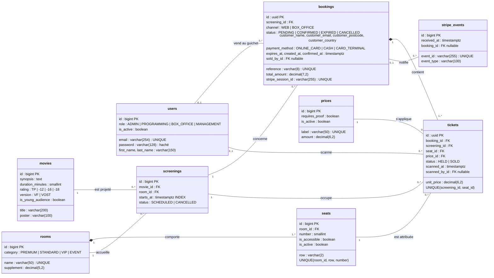

# Modèle de données – Le Grand Cinéma

Diagramme de classes UML des tables de l'application (une classe = une table, nom au pluriel en snake_case).
Les attributs techniques hérités de Django pour les comptes (dernière connexion, groupes…) ne sont pas détaillés.

## Règles portées par la base

| Règle métier | Mise en œuvre | US |
|---|---|---|
| Pas de double vente (web et guichet) | UNIQUE(screening_id, seat_id) sur tickets | 2.2, 7.2 |
| Place libre / bloquée / vendue | libre = pas de ligne ; bloquée = HELD + bookings.expires_at ; vendue = SOLD | 2.1, 2.2 |
| Notification Stripe traitée une seule fois | UNIQUE(event_id) sur stripe_events | 3.1 |
| Prix payé inchangé si le tarif évolue | tickets.unit_price figé à la vente | 6.2 |
| Séance avec réservations non supprimable | clé étrangère ON DELETE PROTECT | 6.1 |
| Pas de chevauchement de séances (durée + 15 min) | contrôle applicatif Screening.clean() | 6.1 |
| Aucune donnée de carte bancaire | seul stripe_session_id est conservé | 3.1 |
| Identifiants non prévisibles | UUID pour bookings et tickets (QR code) | 4.1 |
